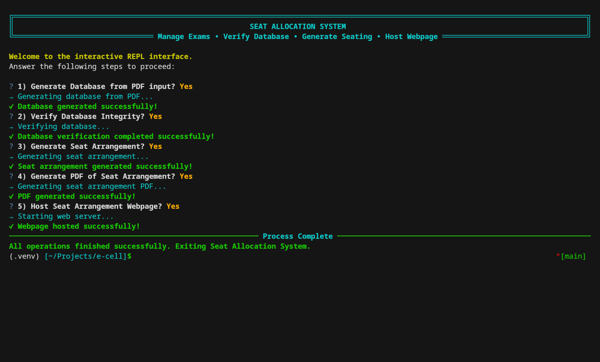

# Examination CELL Seat Allocation Project

## Overview

The aim of this project is to **automate the seat arrangement process** for mid-semester and end-semester examinations.  
Currently, this task is performed manually, which is both time-consuming and error-prone.  
This project generates **room-wise seating plans** automatically and exports them as **PDFs** for easy use by the Examination Cell.

## 

## Features

- ✅ Automatic seat allocation for multiple rooms and sessions.
- ✅ Ensures fair and organized seat distribution.
- ✅ Room capacity is respected using input Excel files.
- ✅ Student, course, and enrollment data imported from spreadsheets.
- ✅ Generates **seating plan PDFs** for each exam session.
- ✅ Clean tabular seating layout with student details and seat numbers.

## Tech Stack

- **Language**: Python 3
- **Database**: SQlite3
- **Libraries**:
  - [ReportLab](https://www.reportlab.com/) → for PDF generation
  - [Pandas](https://pandas.pydata.org/) → for handling Excel/CSV data
  - [SQLite](https://www.sqlite.org/) → for structured exam data storage

## Project Structure

```bash
.
├── app.py                   # Main entry point for running the project
├── data/                    # Input Excel files
│   ├── enrollments.xlsx
│   ├── mte.xlsx
│   ├── room_capacity.xlsx
│   └── students.xlsx
├── data.db                  # SQLite database (auto-generated)
├── functions/               # Core project logic
│   ├── generate_db.py        # Builds database from Excel files
│   ├── pdf_generator.py      # Creates PDF seating plans
│   ├── room.py
│   └── workflow.py
├── output/                  # Generated PDFs for each exam session
│   ├── 2025-09-22 10:00 AM to 11:30 AM seating_arrangement.pdf
│   ├── 2025-09-22 12:30 PM to 2:00 PM seating_arrangement.pdf
│   └── ... (more PDFs by date & time)
├── LICENSE                  # License file
├── README.md                # Project documentation
└── requirements.txt         # Python dependencies

```
